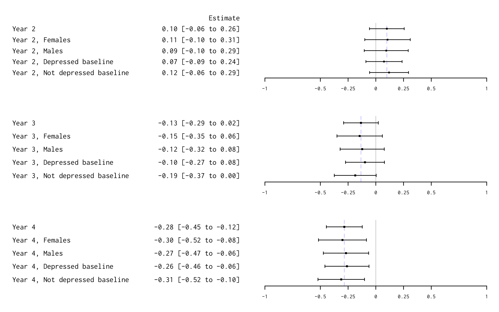

```{r load_packages, include = FALSE}
  library(papaja)
  library(lme4)
  library(ggplot2)
  library(likert)
  library(texreg)
  library(dplyr)
  library(knitr)
  library(multcomp)
  library(forestplot)
  library(gridExtra)
  library(alluvial)
  library(kableExtra)
  suppressMessages(library("tidyverse"))
  library(mediation)
  library(here)
```

```{r preferences}
# seed for random number generation
  set.seed(42)
# document preferences
  options(scipen=999) # turn off scientific notation for numbers
  knitr::opts_chunk$set(warning=FALSE, 
                        message=FALSE, 
                        echo=FALSE)
  nocomma <- function(x){structure(x,class="nocomma")}
  knitr::knit_hooks$set(inline = function(x) {
      if(!inherits(x,"nocomma")) return(prettyNum(x, big.mark=","))
      if(inherits(x,"nocomma")) return(x)
      return(x) # default
    })
# function for significance
  asterisk <- function(y) symnum(y, c(0, .001, .01, .05, .1, 1),
                                        c("***", "**", "*", "·", " "))
  pvallab <- function(y) symnum(y, c(0, .001, .01, .05, .1, 1),
                                        c("< 0.001", "< 0.01", "< 0.05", 
                                          "< 0.10", round(y, 2)))
# rounding functions to keep trailing zeros
  rd0 <- function(y) sprintf("%.0f", round(y, 0))
  rd1 <- function(y) sprintf("%.1f", round(y, 1))
  rd2 <- function(y) sprintf("%.2f", round(y, 2))
  rd3 <- function(y) sprintf("%.3f", round(y, 3))
# texreg font
  coef_tt = function(reg) {
  names(fixef(reg)) = 
    paste0('\\texttt{', names(fixef(reg)), '}')
  reg
  }
```

```{r data}
# import
  dat <- read.csv(here("data and replication files", "input", "dat.csv"), 
                  stringsAsFactors = FALSE)
```

```{r tidy}
# recode ----------------------------------------------------------------------
# depression items
  for (r in 1:4) {
    for (i in paste0("w", r, c("_54a", "_54b", "_54d", "_54e", "_54f"))) {
      dat[,i][is.nan(dat[,i])] <- NA
      dat[i] <- dat[,i] - 1
    }
    for (i in paste0("w", r, c("_54a"))) {
      dat[i] <- 3 - dat[,i]
    }
  }

# construct -------------------------------------------------------------------
  dat$female <- ifelse(dat$gender=="female", 1, 0)

# depression severity
  dat$depress.1 <- rowMeans(dat[,c("w1_54a", "w1_54b", "w1_54d", "w1_54e", 
                                   "w1_54f")], 
                            na.rm=T)
  dat$depress.2 <- rowMeans(dat[,c("w2_54a", "w2_54b", "w2_54d", "w2_54e", 
                                   "w2_54f")], 
                            na.rm=T)
  dat$depress.3 <- rowMeans(dat[,c("w3_54a", "w3_54b", "w3_54d", "w3_54e", 
                                   "w3_54f")], 
                            na.rm=T)
  dat$depress.4 <- rowMeans(dat[,c("w4_54a", "w4_54b", "w4_54d", "w4_54e", 
                                   "w4_54f")], 
                            na.rm=T)
  
# missing
  dat$miss.1 <- 0
  dat$miss.2 <- ifelse(is.na(dat$depress.2), 1, 0)
  dat$miss.3 <- ifelse(is.na(dat$depress.3), 1, 0)
  dat$miss.4 <- ifelse(is.na(dat$depress.4), 1, 0)
  
# out of school
  dat$oos.1 <- ifelse(dat$w1_1==8, 1, 0)
  dat$oos.2 <- ifelse(dat$w2_1==8, 1, 0)
  dat$oos.3 <- ifelse(dat$w3_1==8, 1, 0)
  dat$oos.4 <- ifelse(dat$w4_1==8, 1, 0)
  
# continuous enrollment
  dat$ce <- ifelse((dat$oos.1 + dat$oos.2 + dat$oos.3)==0, 1, 0)
  #dat$ce[is.na(dat$ce)] <- 0
  
# reshape ---------------------------------------------------------------------
  datL <- reshape(dat, 
                  direction="long", 
                  varying=c("depress.1", "depress.2", "depress.3", "depress.4"),
                  v.names=c("depress"),
                  timevar="time",
                  sep=".",
                  times=c(1, 2, 3, 4))
  
# construct long --------------------------------------------------------------
# binary indicator of depression
  datL$dep16 <- ifelse(datL$depress>=0.8, 1, 0)
  datL$dep22 <- ifelse(datL$depress>=1.1, 1, 0)
  
# baseline depression cut 16
  datL <- datL %>%
    group_by(ID) %>%
    mutate(dep16Base = dep16[time == 1L])
  
# time as factor
  datL$time1 <- ifelse(datL$time==1, 1, 0)
  datL$time2 <- ifelse(datL$time==2, 1, 0)
  datL$time3 <- ifelse(datL$time==3, 1, 0)
  datL$time4 <- ifelse(datL$time==4, 1, 0)
  
# standardize depression severity
  datL$depress.z <- scale(datL$depress)
  
# depression status
  datL$depStatus <- ifelse(datL$dep16Base==1 & datL$dep16==1,
                           "still depressed",
                    ifelse(datL$dep16Base==1 & datL$dep16==0,
                           "remission",
                    ifelse(datL$dep16Base==0 & datL$dep16==1,
                           "became depressed",
                    ifelse(datL$dep16Base==0 & datL$dep16==0,
                           "never depressed", "missing"))))
  
  depStatus <- summarise(group_by(datL, 
                                  time=factor(time), 
                                  w1group=factor(w1group), 
                                  status=factor(depStatus)), 
                         count =n())
      
  depStatus$w1group <- factor(depStatus$w1group, 
                              levels=c(0,1),
                              labels=c("control", "intervention"))
  
  depStatus$status <- factor(depStatus$status, 
                             levels=c("never depressed",
                                      "still depressed",
                                      "became depressed",
                                      "remission",
                                      "missing"))
  
  depStatus$time <- factor(depStatus$time,
                           levels=c(1, 2, 3, 4),
                           labels=c("Baseline",
                                    "Year 2",
                                    "Year 3",
                                    "Year 4"))
  
# create strata
  datL <- 
  datL %>%
    mutate(stratum = case_when(w1schoolid==1 | 
                               w1schoolid==2 |
                               w1schoolid==18 |
                               w1schoolid==23 ~ "large",
                               w1schoolid==21 |
                               w1schoolid==26 |
                               w1schoolid==3 |
                               w1schoolid==15 ~ "small",
                               TRUE ~ "medium")) %>%
    mutate(stratum = factor(stratum, 
                            levels=c("small", "medium", "large")))
  
# reliability
  datR <-
  dat %>%
    dplyr::select(w1_54a, w1_54b, w1_54d, w1_54e, w1_54f,
                  w2_54a, w2_54b, w2_54d, w2_54e, w2_54f,
                  w3_54a, w3_54b, w3_54d, w3_54e, w3_54f,
                  w4_54a, w4_54b, w4_54d, w4_54e, w4_54f)
  names(datR) <- c("a.1", "b.1", "d.1", "e.1", "f.1",
                   "a.2", "b.2", "d.2", "e.2", "f.2",
                   "a.3", "b.3", "d.3", "e.3", "f.3",
                   "a.4", "b.4", "d.4", "e.4", "f.4")
  
  datR <- reshape(datR, 
                  direction="long", 
                  varying=c("a.1", "b.1", "d.1", "e.1", "f.1",
                            "a.2", "b.2", "d.2", "e.2", "f.2",
                            "a.3", "b.3", "d.3", "e.3", "f.3",
                            "a.4", "b.4", "d.4", "e.4", "f.4"),
                  v.names=c("a", "b", "d", "e", "f"),
                  timevar="time",
                  sep=".",
                  times=c(1, 2, 3, 4))
  datR <- datR[, -7]
  
  datR1 <- 
  datR %>%
    filter(time==1) %>%
    filter(complete.cases(.)) %>%
    dplyr::select(-time)
  
  datR2 <- 
  datR %>%
    filter(time==2) %>%
    filter(complete.cases(.)) %>%
    dplyr::select(-time)
  
  datR3 <- 
  datR %>%
    filter(time==3) %>%
    filter(complete.cases(.)) %>%
    dplyr::select(-time)
  
  datR4 <- 
  datR %>%
    filter(time==4) %>%
    filter(complete.cases(.)) %>%
    dplyr::select(-time)
  
  R1 <- psych::alpha(datR1)
  R2 <- psych::alpha(datR2)
  R3 <- psych::alpha(datR3)
  R4 <- psych::alpha(datR4)
  
  alpha <- data.frame(
    round=c(1, 2, 3, 4),
    n=c(nrow(datR1), nrow(datR2), nrow(datR3), nrow(datR4)),
    rawa=as.numeric(c(R1$total[1], R2$total[1], R3$total[1], R4$total[1])),
    al95=as.numeric(c(1 - (1 - R1$total[1]) * qf(1-.05/2, nrow(datR1) - 1, Inf),
                      1 - (1 - R2$total[1]) * qf(1-.05/2, nrow(datR2) - 1, Inf),
                      1 - (1 - R3$total[1]) * qf(1-.05/2, nrow(datR3) - 1, Inf),
                      1 - (1 - R4$total[1]) * qf(1-.05/2, nrow(datR4) - 1, Inf))
                    ),
    au95=as.numeric(c(1 - (1 - R1$total[1]) * qf(.05/2, nrow(datR1) - 1, Inf),
                      1 - (1 - R2$total[1]) * qf(.05/2, nrow(datR2) - 1, Inf),
                      1 - (1 - R3$total[1]) * qf(.05/2, nrow(datR3) - 1, Inf),
                      1 - (1 - R4$total[1]) * qf(.05/2, nrow(datR4) - 1, Inf))
                    )
  )
```


# Introduction

With over 140 million orphans worldwide and 52 million in Africa alone [@unicef:2017], identifying strategies for promoting positive developmental outcomes is a public health imperative. In Sub-Saharan Africa, orphans often face challenges at multiple levels, including elevated risk of living in poverty, having less stable caregiving, lacking access to education, experiencing mental and physical health problems, and even acquiring HIV [@cluver:2007;@morantz:2013]. This constellation of risk factors calls for evidence-based intervention approaches that can improve multiple outcomes simultaneously while making the most efficient use of limited resources. In this study, we evaluate whether a program that provides school support affected depression symptoms among a sample of orphans in Kenya. As the intervention had positive impacts on school dropout and some HIV risk behaviors such as male circumcision and transactional sex [@cho:2017;@cho:2018], the current evaluation serves to determine whether it had an additional benefit for adolescents' mental health. 

## Mental Health Needs Among Orphans 

Mental health problems affect an estimated 10 to 20% of children and adolescents worldwide, with children in low- and middle-income countries (LMICs) having very little opportunity for treatment [@kieling:2011]. Evidence suggests that orphans are at even higher risk for mental health problems than their peers [@hermenau:2015;@sengendo:1997;@puffer:2012]. This is most clear among children who have lost parents to AIDS. In their work in South Africa, Cluver and colleagues [-@cluver:2007] have documented higher rates of depression, peer relationship problems, post-traumatic stress, and behavioral problems among children orphaned by AIDS compared with both non-orphans and children orphaned by other causes. In a longitudinal study, they further showed that children orphaned by AIDS continued to exhibit more symptoms than the other two groups four years after their initial assessment, at a time when many had entered adolescence [@cluver:2012]. In Tanzania and Uganda, researchers have documented similar findings with elevated internalizing symptoms among AIDS orphans versus non-orphans [@atwine:2005]. In the South African samples, multiple contributing factors have been documented, including poverty and stigma as mediators between orphan status and poor psychological outcomes [@cluver:2008;@cluver:2009]. Protective factors also have been identified, including perceived social support as a buffer against post-traumatic stress [@cluver:2009]. Overall, there is a great need to address mental health problems among youth in low- and middle-income countries, especially among orphans living in places in Sub-Saharan Africa that continue to struggle with the HIV/AIDS epidemic.

## The Link Between Poverty and Mental Health

Given the innumerable stressors related to living in poverty and in resource-constrained communities, alleviating mental health problems among orphans in LMICs may involve increasing access to economic and social resources. This possibility is supported by evidence that low socioeconomic status (SES) is associated with a higher likelihood of experiencing mental health problems. In a review of 55 studies in high-income countries, results suggested that children with lower SES were approximately two to three times as likely to develop problems related to their mental health [@reiss:2013]. Results were more mixed in a review of 115 studies in LMICs [@lund:2010], with approximately three-fourths of studies documenting a positive association between lower SES and poorer mental health. A closer look at specific measures revealed methodological challenges that contributed to variability in results but also identified specific aspects of poverty most consistently related to mental health outcomes—low education, food insecurity, and financial stress. 

To explore the mechanisms underlying associations between SES and mental health, the social causation and social drift hypotheses provide useful theoretical perspectives [@lund:2011]. The social causation hypothesis posits that social conditions, including poverty, lead to mental health consequences. From this perspective, it follows that poverty alleviation interventions can reduce mental health problems by addressing one of the root causes. In contrast, the social drift, or selection, hypothesis proposes that mental health problems lead to social and economic consequences such that symptoms cause someone to “drift” into poverty. New evidence from a nationally representative panel survey of households in South Africa provides empirical evidence that social causation and drift act simultaneously to create cycles of poverty and illness [@lund:2017].

One perspective that incorporates elements of both causation and drift is the ecobiodevelopmental framework described by Shonkoff and colleagues [-@shonkoff:2012]. They provide extensive evidence that experiencing multiple, chronic adversities during childhood, including poverty, causes "toxic stress" that leads to long-lasting mental and physical health problems, even altering neurological functioning and genetic predispositions. This framework further proposes that the behavioral and cognitive consequences that persist into adulthood affect parenting and decision-making in ways that perpetuate intergenerational cycles of poverty, low educational achievement, and poor mental and physical health—an aspect of this perspective that it more consistent with social drift [@wickrama:2008;@kahn:2004]. Related to this framework, the current study hypothesis is that providing school support may reduce a source of adversity, protecting against mental health problems among children who are likely to have experienced toxic stress earlier in life that places them at higher risk.  

## The Impact of Poverty Alleviation Programs on Mental Health

Lund and colleagues [-@lund:2011] conducted two systematic reviews of the intervention-outcome literature to examine the mental health effects of poverty alleviation interventions and vice versa. Overall, mental health interventions improved economic outcomes more consistently than economic interventions improved mental health. All studies on mental health interventions (*N*=9), including pharmacological, individual therapy, and community-based approaches, showed economic outcome improvements, though not all statistically significant. Results were less consistent for poverty alleviation interventions’ impacts on mental health. A conditional cash transfer program in Mexico yielded inconsistent results on child cognition across evaluations and small reductions in emotional and behavioral problems [@fernald:2009]; a related quasi-experimental analysis of the same program but not included in @lund:2011 showed no effects on a measure of depression and anxiety among children ages 4 to 6 [@ozer:2009]. In Ecuador, an unconditional cash transfer program had small, non-significant results on cognitive and behavioral measures among children ages 3 to 7 [@paxson:2010], and one small loans program in South Africa showed no mental health improvements among adults and actually increased stress levels [@fernald:2008]. 

Several relevant trials involving young people have been published since the Lund et al. systematic review [-@lund:2011], and the evidence continues to be mixed. In a cluster-randomized trial of 120 villages across northern Uganda, Green et al. [-@green:2016] found that cash grants and support to start small businesses had strong economic impacts for households but no effects on symptoms of depression among a sample of young adults, primarily women. Han et al. [-@han:2013] studied the effect of a matched child savings account program in a cluster-randomized trial of 10 schools in Uganda and found that the program reduced depression symptoms among a sample of primary school-aged AIDS-orphans. Baird et al. [-@baird:2013] randomly assigned families in Malawi to receive an unconditional cash transfer, a cash transfer conditional on the girl child's regular school attendance, or a no transfer control condition, and found that both types of transfers reduced  distress among girls ages 13 to 22, but only during the program period. An experimental evaluation of Kenya's Cash Transfer Program for Orphans and Vulnerable Children (CT-OVC) showed positive effects on depression among adolescents (age 12 to 14) whose households had received an unconditional cash transfer over a period of four years, with largest impacts for young men and orphans [@kilburn:2016].

## The Impact of School Support on Mental Health

Another intervention strategy sometimes used in conjunction with cash transfers is direct school support. Unlike a cash transfer that is paid with or without conditions to the student or her family, school support interventions make direct payments to schools to cover school fees and other expenses and may also provide ancillary services such as mentoring or counseling. There is evidence that such programs can improve educational outcomes [@hallfors:2011], but to our knowledge no studies report findings on the indirect effect of school support on adolescent mental health. In this paper, we analyze data from a four-year cluster-randomized trial of a school support intervention conducted with orphaned adolescents in Siaya County, western Kenya, who were about to transition to secondary school. In reporting the primary trial outcomes, Cho et al. [-@cho:2017] demonstrated that the intervention prevented school drop out, but did not improve test scores. We analyzed trial data on depression symptoms to estimate the impact of the intervention on adolescent mental health—a secondary outcome—hypothesizing that the intervention would lead to better mental health outcomes for orphans. As it is possible that reductions in depression could be driven by sustained school enrollment in a setting where secondary school completion is only 41% [@unicef:2018], we also conducted a mediation analysis to test the hypothesis that intervention effects on mental health are mediated by continued school enrollment (a primary outcome reported in Cho et al. [-@cho:2017]).

# Methods

## Setting and Participants

```{r setting}
  k <- length(unique(dat$w1schoolid))
  kT <- length(unique(dat$w1schoolid[dat$w1group==1]))
  kC <- length(unique(dat$w1schoolid[dat$w1group==0]))
  nT <- nrow(dat[dat$w1group==1, ])
  nC <- nrow(dat[dat$w1group==0, ])
```

The cluster randomized trial was conducted in Siaya County in western Kenya. At the time of the study, this area had the highest prevalence of both HIV and orphanhood in Kenya [@nacc:2014].  We selected `r k` primary schools (i.e., clusters) with at least 20 orphans in either grade 7 or 8 per school in 2011. Orphans were defined as individuals who had lost one or both parents to death from any cause [@unicef:2017]. We invited all orphans in grades 7 or 8 to participate and randomized schools to the intervention or control arms using a random number generator (equal allocation, stratified by school enrollment). This resulted in `r kT` schools (*n*=`r nT` students) in the intervention arm and `r kC` schools (*n*=`r nC` students) in the control arm. The study was longitudinal with annual repeated measures collected over 4 years from 2011 to 2014. See [@cho:2018] for full trial details.

## Intervention

The intervention consisted of three components: (a) payment of school tuition fees for secondary school; (b) provision of a school uniform in primary school and the first year of secondary school; and (c) nurse visits. This support was provided from 2011 until 2015, or until the student dropped out of school. The average cost of secondary school fee payments per intervention participant was approximately \$360 per year. The intervention paid all fees (tuition, exam, uniform) directly to schools as long as students remained enrolled, but students were free to attend any school that granted them admission based on their primary school exit exam scores. In addition to paying fees, the intervention hired registered nurses who visited the majority of intervention students monthly to monitor school attendance, track the delivery of fees, and address health problems (e.g. malaria, HIV) that could impact school attendance. Students in control schools did not receive this support, but schools in the control arm were provided cash incentives of \$240 annually to use for their school development projects.

## Procedures

We enrolled `r k` primary schools in the trial and assessed 923 students for eligibility. 837 students enrolled in the study and completed the baseline survey and biomarker testing in 2011. After randomization, one participant was identified to be a non-orphan and one participant withdrew from the study, resulting in an effective sample size of 835. All surveys were administered using audio-assisted self-interview (ACASI) in which students used a personal digital assistant (PDA) to listen to, read, and respond to questions written and recorded in Luo or English. Participants received an honorarium of \$3 for participating in each round of data collection.

## Measures

Improvement in mental health was a secondary trial outcome [@cho:2018]. We administered 5 items from the 20-item Center for Epidemiologic Studies Depression Scale Revised (CESD-R), a self-reported depression screening instrument [@eaton:2004]. Participants were asked, "How often have you felt these ways during the past week?" followed by the following statements: (a) You were happy (reverse scored); (b) You felt sad; (c) You felt depressed; (d) You felt life was not worth living; (e) You felt that you could not shake off the blues, even with help from your family and your friends. Response categories were: (0) Rarely or none of the time (less than 1 day); (1) Some or a little of the time (1-2 days); (2) Occasionally or a moderate amount of time (3-4 days); (3) Most of all of the time (5-7 days). We constructed a scale score for each participant by averaging responses to these five items, which resulted in a score with a possible range of 0 to 3. Estimates of internal consistency reliability ranged from `r rd2(min(alpha$rawa))` to `r rd2(max(alpha$rawa))` across the four rounds (see Table \ref{alpha} in the Appendix). We constructed a dichotomous indicator of possible depression based on a cutoff score of 0.8. A cutoff score of $\geq$ 16 on the full CESD-R (range 0-60) is mathematically equivalent to a cutoff score of $\geq$ 0.8 on our 5-item subset averaged to have a range of 0 to 3. 

## Data Analysis

We used R [@R-base] and the `lme4` package [@R-lme4] to fit several multilevel models with random intercepts for schools and random intercepts and random slopes for time at the individual level since students are nested within waves. To estimate the effect of the intervention on depression symptom severity at each post-baseline wave (Years 2-4), we fit a linear mixed-effects model that included fixed effects for intervention assignment, participants' baseline depression scores, study wave (time as factor), stratum, and all 2-way time x assignment interactions. We also used this model specification to examine subgroup effects by gender and baseline depression status. To estimate the specific effects for females and males, we added an indicator for female gender along with all 2-way time x female interactions and the 3-way time x assignment x female gender interaction. To estimate the specific effects according to baseline depression status, we added an indicator for possible depression at baseline along with all 2-way time x status interactions and the 3-way time x assignment x baseline depression status interaction. As a sensitivity analysis for attrition (intent-to-treat analysis), we imputed 25 sets of missing outcome data and fit the models to the imputed data but found no substantive difference in results.

We also used the `mediation` package [@R-mediation_a] to test the hypothesis that intervention effects on mental health were mediated by continued school enrollment. The proposed mediator (binary) was constructed as continuous enrollment (i.e., no drop out) in Years 1, 2, and 3. The outcome of depression severity was measured a year later in Year 4 to guard against the possibility of reverse causality [@jose:2013;@cole:2003]. We first fit a multilevel logistic model for the conditional distribution of the mediator given assignment to intervention and stratum. Then we fit a multilevel linear model for the conditional distribution of the outcome given the proposed mediator, assignment to intervention, and the stratum. Both models included random intercepts for schools. The fitted model results were then used to estimate the average causal mediation effect, the average direct effect, and the total effect. We used quasi-Bayesian Monte
Carlo simulation (10,000 simulations) for variance estimation.

This trial was powered to detect small effects (*d*=0.28) on the primary study outcomes of HIV and herpes simplex virus 2 incidence comparing group difference given single endline point reported in Cho et al. [-@cho:2018]. This translates into a mean difference of 0.18 on the secondary outcome of depression, which was measured on a 0 to 3 scale. From the baseline mean of 0.86 on the outcome, a difference of 0.18 represents a change of 21 percent in terms of depression severity. We used the `powerlmm` package in R [@powerlmm] to estimate the power for a longitudinal multilevel model. With 4 time points, approximately 32 subjects per cluster, 13 clusters per arm, 0.02 baseline variance at the subject- and cluster-levels, we had power of 80% to detect a standardized effect size of 0.27 or larger.

## Ethical Review

All study participation was voluntary. We obtained written informed permission from either a surviving parent or custodial guardian and written assent from all participants. The institutional review boards of the Pacific Institute for Research and Evaluation (US) and Moi University (Kenya) reviewed and approved all study procedures. The original trial was registered at clinicaltrials.gov (ID: NCT01501864).

# Results

## Participant Characteristics

Table \ref{part} displays participant characteristics at baseline. The average student was `r rd1(mean(dat$age1oct14)-3)` years old in 2011 and was 2.4 years behind grade for age. Approximately half of the sample was female, and about a third were double orphans. This was a non-clinical sample, but the average participant scored above the adjusted cutoff for possible depression on the abbreviated 5-item CESD-R scale.

```{r part, results='asis'}
  cesd1Tm <- mean(dat$depress.1[dat$w1group==1], na.rm=TRUE)
  cesd1Tsd <- sd(dat$depress.1[dat$w1group==1], na.rm=TRUE)
  cesd1Cm <- mean(dat$depress.1[dat$w1group==0], na.rm=TRUE)
  cesd1Csd <- sd(dat$depress.1[dat$w1group==0], na.rm=TRUE)
  
  part <- data.frame(Intervention=c(nT, "14.8 (1.5)", "48.0", "35.6", 
                                    "2.4 (1.4)", 
                                    paste0(rd2(cesd1Tm),
                                           " (",
                                           rd2(cesd1Tsd),
                                           ")")),
                     Control=c(nC, "14.8 (1.6)", "48.5", "34.1", 
                               "2.4 (1.5)",
                               paste0(rd2(cesd1Cm),
                                      " (",
                                      rd2(cesd1Csd),
                                      ")")))
  rownames(part) <- c("N",
                      "Mean age in 2011 (SD)",
                      "Female (%)",
                      "Double orphan (%)",
                      "Mean years behind grade for age (SD)",
                      "Mean CESD-R score (SD)")
  
  kable(part, format = "latex", booktabs = TRUE,
        caption="\\label{part}Participant characteristics at baseline")
```

## Intervention Fidelity, Intervention Compliance, and Attrition

Implementation fidelity for school fees and uniforms was high, 94% and 96% respectively [see @hallfors:2017 for details]. There was full compliance to the randomization. As shown in Table \ref{miss}, study attrition was very low in Years 2 and 3, and moderate in the final round of data collection in Year 4 (9\% among the intervention group and 11.6\% among the control group). The difference between study arms in mean depression baseline scores among attriters is not statistically significant.

```{r att, results='asis'}
# mean baseline depression among not found at wave 2, T
  dep2NFTm <- mean(dat$depress.1[dat$miss.2==1 & dat$w1group==1])
  dep2NFTsd <- sd(dat$depress.1[dat$miss.2==1 & dat$w1group==1])
# mean baseline depression among not found at wave 2, C
  dep2NFCm <- mean(dat$depress.1[dat$miss.2==1 & dat$w1group==0])
  dep2NFCsd <- sd(dat$depress.1[dat$miss.2==1 & dat$w1group==0])
# mean baseline depression among not found at wave 3, T
  dep3NFTm <- mean(dat$depress.1[dat$miss.3==1 & dat$w1group==1])
  dep3NFTsd <- sd(dat$depress.1[dat$miss.3==1 & dat$w1group==1])
# mean baseline depression among not found at wave 3, C
  dep3NFCm <- mean(dat$depress.1[dat$miss.3==1 & dat$w1group==0])
  dep3NFCsd <- sd(dat$depress.1[dat$miss.3==1 & dat$w1group==0])
# mean baseline depression among not found at wave 4, T
  dep4NFTm <- mean(dat$depress.1[dat$miss.4==1 & dat$w1group==1])
  dep4NFTsd <- sd(dat$depress.1[dat$miss.4==1 & dat$w1group==1])
# mean baseline depression among not found at wave 4, C
  dep4NFCm <- mean(dat$depress.1[dat$miss.4==1 & dat$w1group==0])
  dep4NFCsd <- sd(dat$depress.1[dat$miss.4==1& dat$w1group==0])
  
  miss <- data.frame(Intervention=c("5 (1.2)",
                                    "4 (0.98)",
                                    "39 (9.5)",
                                    paste0(rd2(dep2NFTm),
                                           " (",
                                           rd2(dep2NFTsd),
                                           ")"),
                                    paste0(rd2(dep3NFTm),
                                           " (",
                                           rd2(dep3NFTsd),
                                           ")"),
                                    paste0(rd2(dep4NFTm),
                                           " (",
                                           rd2(dep4NFTsd),
                                           ")")),
                     Control=c("14 (3.3)",
                               "21 (4.9)",
                               "49 (11.6)",
                               paste0(rd2(dep2NFCm),
                                      " (",
                                      rd2(dep2NFCsd),
                                      ")"),
                               paste0(rd2(dep3NFCm),
                                      " (",
                                      rd2(dep3NFCsd),
                                      ")"),
                               paste0(rd2(dep4NFCm),
                                      " (",
                                      rd2(dep4NFCsd),
                                      ")")),
                     p=c("",
                         "",
                         "",
                         rd2(summary(lm(depress.1 ~ w1group, data=dat[dat$miss.2==1, ]))$coefficients[2,4]),
                         rd2(summary(lm(depress.1 ~ w1group, data=dat[dat$miss.3==1, ]))$coefficients[2,4]),
                         rd2(summary(lm(depress.1 ~ w1group, data=dat[dat$miss.4==1, ]))$coefficients[2,4])))
  
  rownames(miss) <- c("Year 2 (%)", 
                      "Year 3 (%)", 
                      "Year 4 (%)",
                      "Year 2, Mean (SD)", 
                      "Year 3, Mean (SD)", 
                      "Year 4, Mean (SD)")
  
  kable(miss, format = "latex", booktabs = TRUE,
        caption="\\label{miss}Study attrition by wave and differences in baseline depression scores among attriters by study assignment") %>%
    kable_styling() %>%
    group_rows("Study Attrition", 1, 3) %>%
    group_rows("Baseline CESD-R Scores", 4, 6)
```

## Intervention Effects

Figure \ref{depSeverity} shows the mean depression score by wave and study assignment. The intervention group average moves up and down within a narrow range and is largely stable over the four years. The same can be said for the control group through the first two years before the mean score begins to trend upwards. By Year 4, control group appears to be worse on average compared to the intervention group. 

```{r ate, fig.cap="Mean depression severity score by study wave. We administered 5 items from the 20-item Center for Epidemiologic Studies Depression Scale Revised (CESD-R), a self-reported depression screening instrument. Participants responded to each item on a 0-3 scale. We constructed a scale score for each participant by averaging responses to these five items, which resulted in a score with a possible range of 0 to 3.\\label{depSeverity}"}
  datL %>%
    group_by(time, w1group) %>%
    summarise(meanDep = mean(depress, na.rm = TRUE)) %>%
    ggplot(., aes(x=time, y=meanDep, linetype=factor(w1group))) +
      geom_line() +
      ylim(0,1.25) +
      theme_bw() +
      ylab("Mean Depression Score (CESD-R, 0-3)") +
      xlab("Study Wave (Years)") +
      scale_linetype_discrete(name="Assignment",
                              breaks=c(0, 1),
                              labels=c("Control", "Intervention"))
```

```{r models}
  source(here("data and replication files", "reports", "depSeverity.R"))
```

Figure \ref{plotTF} displays the estimated intervention effects by wave, gender, and baseline depression status (using scaled cutoff of 16). It appears that the intervention effect emerges over time, and by Year 4 the 95 percent confidence intervals exclude zero. The standardized effect size at the last wave is `r m1.time4`. The intervention does not seem to reduce symptom severity, however. Instead, it seems to keep levels stable on average relative to the increase observed in the control group over time.

There does not appear to be a gender effect. The effect for males and females are largely overlapping at Year 4, and the coefficient on the 3-way interaction of assignment x female x Year 4 is small and non-significant (see Table \ref{m123} in the Appendix). The same can be said about the subgroup analysis for baseline depression. There is not a differential effect of the intervention on depression scores by possible baseline depression status.

```{r ploteffects, echo=FALSE, fig.cap="Standardized intervention effects by year (factor), gender, and possible depression at baseline. The main estimates for each year come from a linear mixed-effects model that included fixed effects for intervention assignment, participants' baseline depression scores, study wave (time as factor), and all 2-way time x assignment interactions. For instance, the Year 4 estimate is the linear combination of the coefficients on study assignment and the 2-way interaction between assignment and the indicator for a Year 4 observation. The subgroup estimates for gender and possible baseline depression come from two separate models that use the same base specification. The gender model includes an additional indicator for female gender along with all 2-way time x female interactions and the 3-way time x assignment x female gender interaction. The baseline depression model includes an indicator for possible depression at baseline along with all 2-way time x status interactions and the 3-way time x assignment x baseline depression status interaction. There are no significant differences by subgroup.\\label{plotTF}", out.width = "100%"}
  
```

Figure \ref{depStatus} shows that by Year 4, fewer members of the intervention group remained above (still depressed) or surpassed (became depressed) the threshold for possible depression compared to the control group. The intervention group was also more likely to achieve remission (became non-depressed).

```{r depStatus, fig.cap="Depression status in Year 4 relative to baseline depression status. Possible depression is defined as an abbreviated CESD-R scale score greater than or equal to 0.8. A cutoff score of greater than or equal to 16 on the full CESD-R (range 0-60) is mathematically equivalent to a cutoff score of 0.8 on our 5-item subset averaged to have a range of 0 to 3.\\label{depStatus}"}
  
  old <- ggplot(depStatus, aes(status, count, fill=w1group, color=w1group)) +
    geom_bar(stat="identity", position = "dodge") + 
    facet_wrap(~time, nrow=2) +
    scale_fill_manual(values=c("white", "black"), 
                      name="Assignment",
                      breaks=c("control", "treatment"),
                      labels=c("control", "intervention")) +
    scale_color_manual(values=c("black", "black"), 
                       name="Assignment",
                       breaks=c("control", "treatment"),
                       labels=c("control", "intervention")) +
    theme_bw() +
    theme(legend.position = "top",
          axis.title.x=element_blank(),
          panel.grid.major = element_blank(), 
          panel.grid.minor = element_blank(),
          axis.text.x=element_text(angle=45, hjust=1))

  depStatus %>%
    filter(time=="Year 4" & !is.na(status)) %>%
    ggplot(., aes(status, count, fill=w1group, color=w1group)) +
      geom_bar(stat="identity", position = "dodge") + 
      scale_fill_manual(values=c("white", "black"), 
                        name="Assignment",
                        breaks=c("control", "intervention"),
                        labels=c("control", "intervention")) +
      scale_color_manual(values=c("black", "black"), 
                         name="Assignment",
                         breaks=c("control", "intervention"),
                         labels=c("control", "intervention")) +
      theme_bw() +
      theme(legend.position = "top",
            axis.title.x=element_blank(),
            panel.grid.major = element_blank(), 
            panel.grid.minor = element_blank(),
            axis.text.x=element_text())
```

## Causal Mediation Analysis

```{r mediation, include=FALSE, cache=TRUE}
  datMed <- datL[datL$time4==1, c("ce", "w1group", "stratum",
                                  "w1schoolid", "depress.z")]
  datMed <- datMed[complete.cases(datMed), ]
  
  med.fit <- glmer(ce ~ w1group + stratum +
                     (1 | w1schoolid),
                   data=datMed,
                   family="binomial")
  out.fit <- lmer(depress.z ~ ce + w1group + stratum + 
                    (1 | w1schoolid),
                  data=datMed)
  
  set.seed(4320)
  
  med.out <- mediate(med.fit, out.fit, treat="w1group", mediator="ce",
                     robustSE=TRUE, sims=100)
  summary(med.out)
  plot(med.out)
  
  ACME <- med.out$d.avg
  ACME.p <- med.out$d.avg.p
  ADE <- med.out$z.avg
  TE <- med.out$d.avg+med.out$z.avg
  PM <- med.out$n.avg
  PM.p <- med.out$n.avg.p
```

Finding that school support increased school enrollment [@cho:2017] and appeared to buffer against depression symptoms over time, we hypothesized that this effect on depression might be mediated by the effect of the intervention on school enrollment. We observed partial mediation. The total effect of the intervention on standardized depression scores at Year 4 was `r rd2(TE)` standard deviations. The direct path was reduced by `r rd2(ACME)` (*p*=`r rd2(ACME.p)`). Overall, `r rd1(PM*100)` percent of the intervention effect on depression was mediated by continuous school enrollment, *p*=`r rd2(PM.p)`. This increases to 9.6 percent (*p*=0.02) if we assume that students who were missing at follow-up were out of school.

# Discussion

The results of this study contribute to the scarce literature on the impact of school support interventions on orphan mental health in a low-income setting. Through an experimental design and longitudinal data collection, we found that an intervention consisting of direct fee payments to schools, uniforms, and nurse visits prevented depression severity scores from increasing over time among adolescents recruited from intervention schools. There was no evidence of treatment heterogeneity by gender or baseline depression status.

We interpret these results to suggest that school support may buffer against the onset or worsening of depression symptoms over time, promoting resilience among an important at-risk population. The framework of toxic stress [@shonkoff:2012] suggests that early adversities, common among orphans in LMICs, can have lasting impacts on mental health, so these orphans are at high risk for developing depression and experiencing persistent depression throughout adulthood. Results of this study show that the intervention may have helped to buffer these long-term effects, shifting the trajectory that these adolescents were on in the absence of inserting this important protective factor of education.

That said, more work remains to understand the mechanism of action of school support on mental health. One interesting finding is that the buffering effect of the intervention was incremental. This could reflect mounting pressures on control students not shared by intervention students. For instance, difficulty paying secondary school fees is a major source of stress for orphaned students in low-income countries that can accumulate over time [@dorsey:2015; @cluver:2007]. It is possible that control students experienced increasing stress as they struggled to remain enrolled, whereas intervention students were spared this particular stressor due to the education guarantees of the program. Another stressor that disproportionately affected control students over time was drop out. Aside from the financial stress of paying school fees, control students had to cope with the loss of enrollment at a higher rate compared to the intervention students. As originally reported in @cho:2017, the intervention reduced the odds of drop out by 59%. In the current analysis, we found that the intervention effect on depression was partially mediated by higher levels of continuous school enrollment among the intervention group, but this mediated effect was small.

We can anchor these results in the broader literature about child and adolescent mental health treatment in LMICs. On one end of the spectrum sit economic interventions that are designed to improve quality of life and human capital and could have indirect effects on mental health. These include the school support program we tested, other conditional cash transfer programs that make support contingent upon certain actions of beneficiaries (e.g., @han:2013; @fernald:2009; @baird:2013; @ozer:2009; @green:2016), and unconditional cash transfer programs (e.g., @kilburn:2016; @paxson:2010; @baird:2013). These programs are most often run with poor and potentially vulnerable populations like orphans, but not clinical samples identified because of a pre-existing condition like depression. On the other end of the spectrum are individual and group treatments for depression, anxiety, and post-traumatic stress disorder.

Among the published economic interventions that have assessed mental health outcomes among children and adolescents, most standardized point estimates of the treatment effect are in the 0 to .20 range (this study found an effect size of `r abs(as.numeric(m1.time4))`. See Table X in the Appendix for a comparison of effect sizes across studies. @yatham:2017 reviewed the results of 21 trials of treatments for depression, anxiety, and post-traumatic stress disorder conducted with children and adolescents in LMICs. 15 of these trials were conducted in conflict-affected settings. Among the studies conducted in conflict-affected settings with clinical populations, standardized point estimates range from nearly 0 to 0.61 (median 0.22). Therefore, it seems reasonable to conclude that economic interventions could play an important role in improving mental health outcomes as we continue to expand access to direct treatment options in low-resource settings.

## Limitations

Major strengths of this study include the cluster randomized design, large sample size, and longitudinal data collection conducted over four years with relatively low attrition. However, as is often the case in mental health studies, our only measure of depression was self-report, and in this case included only a small number of items to reduce participant burden. Furthermore, there is only limited evidence from South Africa, and none yet from Kenya, that the CESD is a valid measure of depression in this context [@sweetland:2014]. Of course an absence of evidence is not evidence of absence, but it is necessary to view the results with some caution.

It is important to recognize the limitations of school support interventions if the primary aim is the reduction of mental health problems. The results of this evaluation suggest that intervention effects on depression—a secondary outcome—are not large, suggesting that while school support may be protective against the onset or worsening of mental health problems, it is not sufficient. Future research is needed to explore the efficacy of school support combined with evidence-based strategies for mental health prevention and treatment. For instance, there is evidence that school-based mental health interventions hold promise in LMICs [@barry:2013;@fazel:2014]. Combined with direct school support, mental health interventions could then potentially help to break cycle of poverty given evidence that such interventions can have economic effects [@lund:2011].

## Conclusions

School support for orphans may help to buffer against the onset or worsening of depression symptoms over time, promoting resilience among an important at-risk population. 

\newpage

# References
```{r create_r-references}
  r_refs(file = "r-references.bib")
```

```{r appendix, include=FALSE, eval=T}
  render_appendix(here("data and replication files", "reports", "appendix.Rmd"))
```


\setlength{\parindent}{-0.5in}
\setlength{\leftskip}{0.5in}